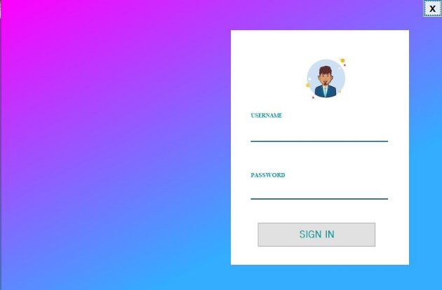
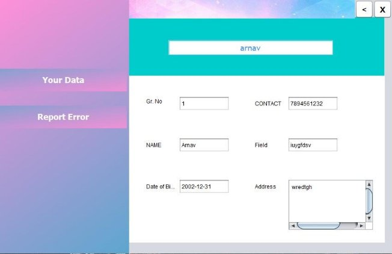
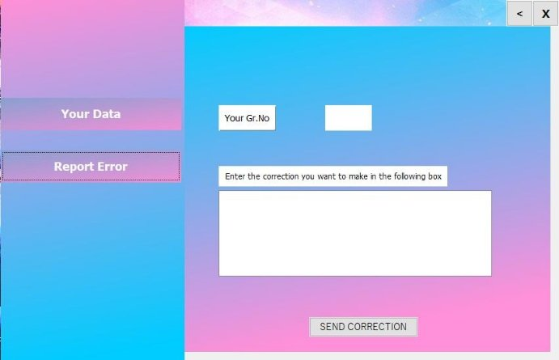
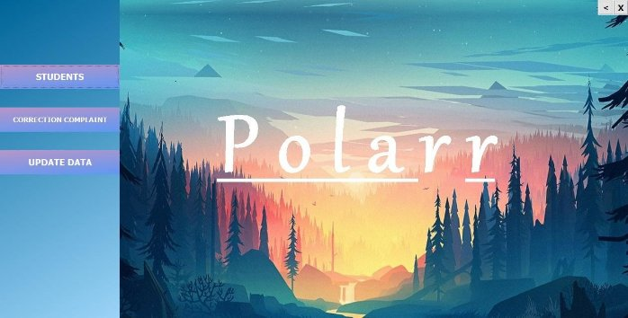
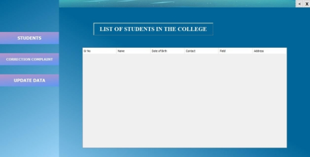
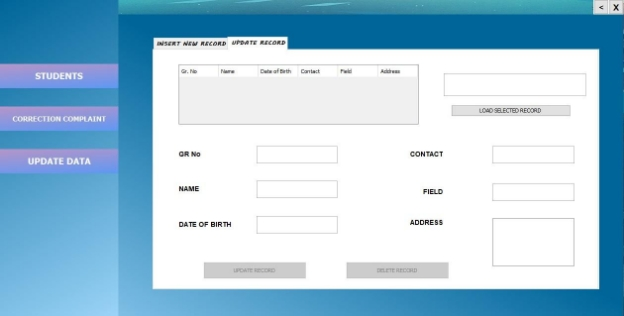
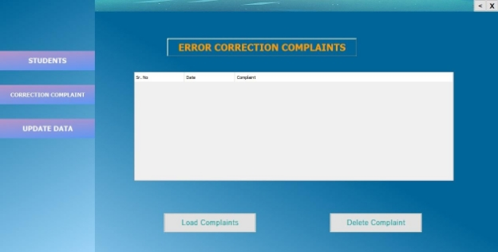
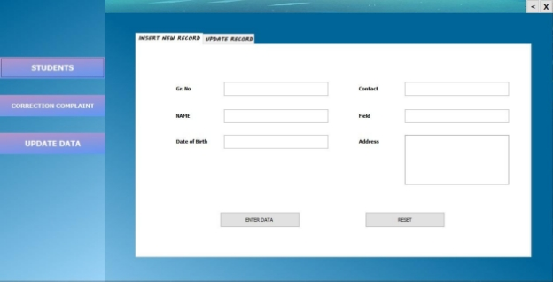

**Polarr**

**A Student Data Management System**

LOGIN PAGE

It’s the main Page of our program. From here the user which is either a college authority or a student can access the page. Username for the college representative is “college” and the username for Student is “student”. Both the usernames are case insensitive. The password for both the accounts is “Polarr”. After signing in, the respective pages for student and college representatives appear.

The user can also close the program by clicking the cross button given on the right hand top corner.

STUDENT PAGE

This page opens up when a student logins into his account. He/She can view all his details from the tab ‘Your Data’. The student should enter his GR. no. and he will be shown all his data. 

In case there is any problem in his data then he can go to the ‘Report Error’ tab and write about the correction which is to be made in his data. This report directly goes to the college authorities. Then the authorities can make changes in the students data as per reported. 

The user can also go back to the Login Page by clicking the Back button given on the right hand top corner

COLLEGE PAGE

This is the page for college authorities. It consists of a list of students in a particular University. The authority can add, delete and update data of students. The reports sent by the students are shown in the ‘Correction Complaint’ tab. The authority can directly update the report sent by the student   by using the search bar to search name and load the searched record by pressing a button. (load button)

    

` `Update And Delete Function 

MySQL Tables

Table to Store Student Data:

Table to Store Complaints:
 
